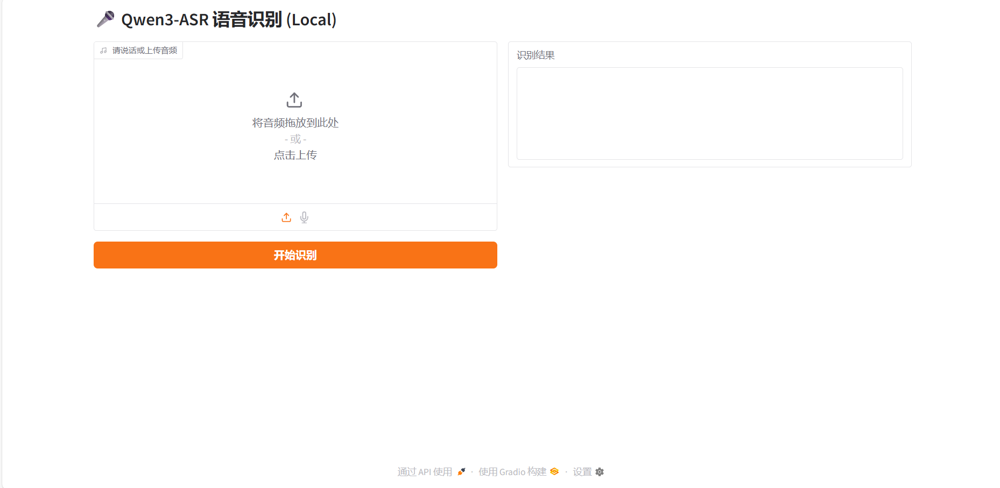

# Qwen3-ASR WebUI

一个基于 Docker 的 **Qwen3-ASR** 语音识别一键部署方案，包含直观的 Web 界面。

本项目将阿里通义千问团队的 Qwen3-ASR 模型封装在 Docker 容器中，并提供了一个基于 Gradio 的图形化操作界面，支持本地音频上传和麦克风实时录音识别。

## 主要特性

- 🚀 **一键部署**：通过 Docker 快速启动，环境配置全自动。
- 🖥️ **Web 界面**：直接在浏览器操作，无需敲任何命令。
- ⚡ **GPU 加速**：完整支持 NVIDIA GPU 推理 (依赖 NVIDIA Container Toolkit)。
- 🧩 **模型外挂**：模型文件通过 `-v` 挂载，镜像体积小，方便分发。
- 🌏 **国内优化**：内置自动使用国内镜像源下载模型（HF-Mirror）。

## 快速开始

### 1. 准备工作

确保您的电脑已安装：
- [Docker Desktop](https://www.docker.com/products/docker-desktop/) (Windows/Mac/Linux)
- NVIDIA 显卡驱动 (推荐)

### 2. 拉取镜像 & 下载模型

推荐先在本地下载好模型文件（约 5GB），以免每次容器重启都要重新下载：

```bash
# (Windows PowerShell 示例)
# 1. 创建目录
mkdir qwen-model
cd qwen-model

# 2. 下载模型 (使用 huggingface-cli 或手动下载)
# 推荐设置国内镜像加速: $env:HF_ENDPOINT = "https://hf-mirror.com"
huggingface-cli download --resume-download Qwen/Qwen3-ASR-1.7B --local-dir .
```

### 3. 启动容器

使用以下命令一键启动服务：

```bash
# 请将 E:\dockerfile\model 替换为您实际的模型存放路径
docker run -d --gpus all -p 8000:80 \
  -v "E:\dockerfile\model:/data/shared/Qwen3-ASR/model" \
  ghcr.io/pordlm/qwen3-asr-webui:latest
```

*如果不想挂载本地模型，可以直接运行，容器内会自动尝试在线下载（需网络畅通）。*

### 4. 访问服务

等待约 1-2 分钟（模型加载时间），打开浏览器访问：

👉 [http://localhost:8000](http://localhost:8000)

## 截图



## 许可证

本项目代码遵循通过 WebUI 封装的 Apache-2.0 协议。
基础模型 [Qwen3-ASR](https://huggingface.co/Qwen/Qwen3-ASR-1.7B) 版权归 Qwen Team 所有，遵循 Apache-2.0 协议。

## 致谢

- [QwenLM/Qwen3-ASR](https://github.com/QwenLM/Qwen3-ASR)
- [Hugging Face](https://huggingface.co/)
- [Gradio](https://gradio.app/)
